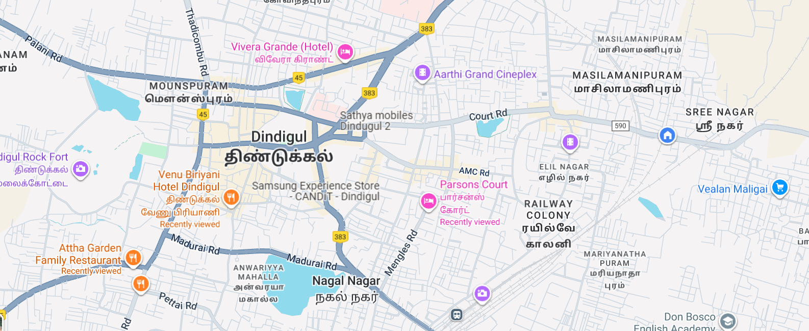

# Ex04 Places Around Me
## Date: 24.09.25

## AIM
To develop a website to display details about the places around my house.

## DESIGN STEPS

### STEP 1
Create a Django admin interface.

### STEP 2
Download your city map from Google.

### STEP 3
Using ```<map>``` tag name the map.

### STEP 4
Create clickable regions in the image using ```<area>``` tag.

### STEP 5
Write HTML programs for all the regions identified.

### STEP 6
Execute the programs and publish them.

## CODE
```
map.html

<html>
    <head>
        <title>Web-4</title>
    </head>
    <body>
        <h1 align="center">Dindigul</h1>
        <h1 align="center">vivek christo A-25013444</h1>
    

<map name="image-map">
    <area target="" alt="dindigul rock fort" title="dindigul rock fort" href="fort.html" coords="8,295,177,361" shape="rect">
    <area target="" alt="attha garden restaurant" title="attha garden restaurant" href="restaurant.html" coords="219,507,66" shape="circle">
    <area target="" alt="parsons court" title="parsons court" href="court.html" coords="840,361,819,409,872,442,945,424,987,378,923,346" shape="poly">
    <area target="" alt="venu biriyani hotel" title="venu biriyani hotel" href="hotel.html" coords="309,324,455,428" shape="rect">
    <area target="" alt="vivera grande" title="vivera grande" href="vivera.html" coords="452,72,689,128" shape="rect">
    </map>
    </body>
</html>

fort.html

<html>
    <head>
        <title>dindigul rock fort</title>
    </head>
    <body BGCOLOR="yellow">
        <h3 align="center">DINIGUL ROCK FORT</h3>
        <p>The Dindigul Fort or Dindigul Malai Kottai and Abirami amman Kalaheswarar Temple was built in 16th-century by Madurai Nayakar Dynasty situated in the town of Dindigul in the state of Tamil Nadu in India. The fort was built by the Madurai Nayakar king Muthu Krishnappa Nayakar in 1605.</p>
<br> Dindigul Fort Temple, Muthalagupatty, Dindigul, Tamil Nadu 624002</br>
<br>Height: 900 feet


    </body>
</html>

restaurant.html

<html>
    <head>
    <title>attha garden restaurant</title>
</head>
<body bgcolor="FF9999">
    <h3 align="center">ATTHA GARDEN RESTAURANT</h3>
    <p>Top-rated family dining, authentic South Indian food, delicious Tamil Nadu cuisine, best non-veg restaurant, must-visit place in Dindigul, homely food.</p>
    <br>Address: No.3A, Batlagundu Road, opp. Periya Pallivasal, Begambur, Tamil Nadu 624002
</body>
</html>

court.html

<html>
    <head>
        <title>parsons court</title>
    </head>
    <body bgcolor="cyan">
        <h3 align="center">PARSONS COURT</h3>
        <p>A very well Maintained business hotel in Dindigul. Close to the bus stand. Approach road is a bit not good. Car parking at an open site close to the hotel.</p>
        <br>Address: 85, Mengles Rd, Mendonsa Colony, Nagal Nagar, Tamil Nadu 624003
    </body>
</html>

hotel.html

<html>
    <head>
        <title>venu biriyani hotel</title>
    </head>
    <body BGCOLOR="yellow">
        <h3 align="center">VENU BIRIYANI HOTEL</h3>
        <p>venu biriyani hotel is a very well known hotel in dindigul for its super taste biriyani and other dishes.it is located in bangambore.it is one of biggest hotel in all over tamil nadu</p>
    </body>
</html>

vivera.html

<html>
    <head>
        <title>vivera grande</title>
    </head>
    <body bgcolor="cyan">
        <h3 align="center">VIVERA GRANDE</h3>
        <p>VIVERA grande in Dindigul, Tamil Nadu, is a hotel known for its spacious rooms, on-site amenities including a spa, gym, and swimming pool, and dining options such as a multi-cuisine restaurant and a rooftop bar and restaurant. It offers both indoor and outdoor pools and serves as a venue for events and functions. </p>
    </body>
</html>

## OUTPUT
c:\Users\Vivek Christo A\Pictures\Screenshots\Screenshot (24).png
c:\Users\Vivek Christo A\Pictures\Screenshots\Screenshot (25).png
c:\Users\Vivek Christo A\Pictures\Screenshots\Screenshot (26).png
c:\Users\Vivek Christo A\Pictures\Screenshots\Screenshot (27).png
c:\Users\Vivek Christo A\Pictures\Screenshots\Screenshot (28).png
c:\Users\Vivek Christo A\Pictures\Screenshots\Screenshot (29).png


## RESULT
The program for implementing image maps using HTML is executed successfully.
